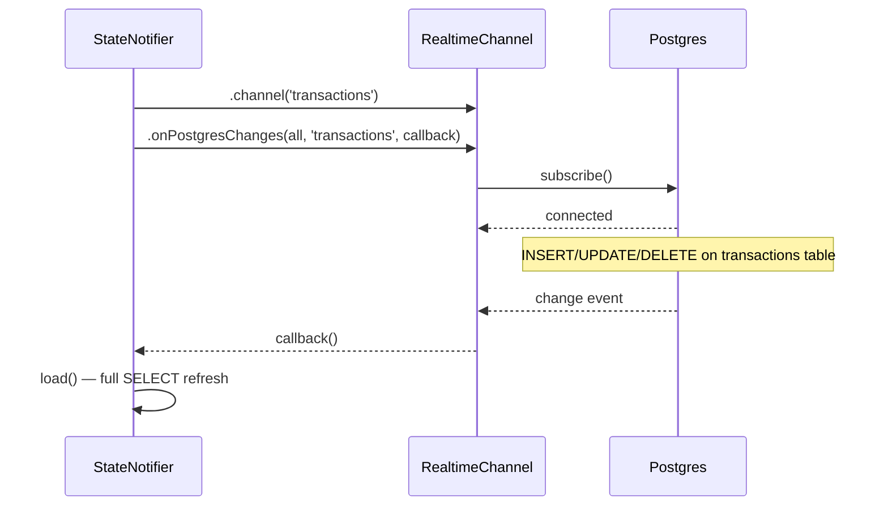

# API Reference

All backend interactions go through two interfaces:
1. **Supabase client SDK** (`supabase_flutter`) — table CRUD, RPCs, Realtime subscriptions
2. **Gemini API** (2.5 Flash, OpenAI-compatible endpoint) — Agent Desk Q&A

No custom backend server. Everything is client-to-service today. **Planned
(Phase 3):** all Gemini traffic moves behind one authenticated Supabase Edge
Function and the browser-side `GEMINI_API_KEY` is removed and rotated; **Phase
2** adds owner authentication so every Supabase call below runs under the
owner's JWT instead of the open anon policies.

---

## Supabase Client

Initialised once at startup via `SupabaseService` singleton.

```dart
// lib/core/supabase.dart
await Supabase.initialize(
  url: dotenv.env['SUPABASE_URL'],
  publishableKey: dotenv.env['SUPABASE_ANON_KEY'],
);
```

Access throughout the app:

```dart
SupabaseService().client.from('transactions').select();
```

---

## Table Operations

### `transactions`

| Operation | Method | Code |
|---|---|---|
| List (full ledger — **defect D4**, cursor pagination planned in Phase 7) | `SELECT` | `.from('transactions').select('*, transaction_labels(label:labels(id, name, color))').eq('is_deleted', false).order('created_at', ascending: false)` |
| Insert | `INSERT` | `.from('transactions').insert(tx.toJson()).select()` then label rows into `transaction_labels` |
| Update (appends `edit_history`) | `UPDATE` | `.from('transactions').update({...tx.toJson(), 'edit_history': history}).eq('id', id)` then label replacement — **planned:** replaced by the atomic `save_transaction_with_labels` RPC (Phase 5) |
| Soft delete | `UPDATE` | `.from('transactions').update({'is_deleted': true, 'deleted_at': DateTime.now().toIso8601String()}).eq('id', id)` |
| Filter by account | `SELECT` | `.from('transactions').select().eq('account_id', accountId)` |
| Filter by invoice | `SELECT` | `.from('transactions').select().eq('linked_invoice_id', invoiceId)` |
| Duplicate check (SMS-sourced) | `SELECT` | `.from('transactions').select('id').eq('raw_sms_hash', sha256(rawText)).maybeSingle()` |

### `goals`

| Operation | Method | Code |
|---|---|---|
| List | `SELECT` | `.from('goals').select().eq('is_deleted', false).limit(100)` |
| Insert | `INSERT` | `.from('goals').insert(goal.toJson())` |
| Allocate (**defect D6** — read-then-write with no history; replaced by a `goal_contributions` transactional RPC in Phase 6) | `UPDATE` | `.from('goals').update({'allocated_amount': newTotal}).eq('id', id)` |
| Soft delete | `UPDATE` | `.from('goals').update({'is_deleted': true, 'deleted_at': ...}).eq('id', id)` |

### `invoices`

| Operation | Method | Code |
|---|---|---|
| List | `SELECT` | `.from('invoices').select().order('created_at', ascending: false).limit(100)` |
| Insert | `INSERT` | `.from('invoices').insert(inv.toJson())` |
| Update | `UPDATE` | `.from('invoices').update(inv.toJson()).eq('id', id)` |
| Soft delete | `UPDATE` | `.from('invoices').update({'is_deleted': true}).eq('id', id)` |

### `category_rules`

| Operation | Method | Code |
|---|---|---|
| List (ordered) | `SELECT` | `.from('category_rules').select().order('priority', ascending: true)` |
| Insert | `INSERT` | `.from('category_rules').insert(rule.toJson())` |

### `accounts`

| Operation | Method | Code |
|---|---|---|
| List | `SELECT` | `.from('accounts').select()` |
| Insert | `INSERT` | `.from('accounts').insert(account.toJson())` |

### `recurring_expenses`

| Operation | Method | Code |
|---|---|---|
| List | `SELECT` | `.from('recurring_expenses').select()` |
| Agent context | `SELECT` | `.from('recurring_expenses').select('name, amount, frequency').eq('frequency', 'monthly')` |

### `recurring_income`

| Operation | Method | Code |
|---|---|---|
| List | `SELECT` | `.from('recurring_income').select()` |
| Agent context | `SELECT` | `.from('recurring_income').select('name, amount, frequency, next_expected')` |

### `monthly_snapshots`

| Operation | Method | Code |
|---|---|---|
| List (trend chart) | `SELECT` | `.from('monthly_snapshots').select().order('year', ascending: false).order('month', ascending: false).limit(12)` |
| Insert (monthly job) | `INSERT` | `.from('monthly_snapshots').insert(snapshot.toJson())` |

---

## RPC Functions

### `fn_account_balance(p_account_id)`

Returns the derived current balance for an account: `opening_balance + SUM(inflows) - SUM(outflows)` for transactions after `opening_date`. Since migration `00004` it uses the explicit `direction` column (not `type`), so transfer and investment legs are balanced correctly per account. Uses `COALESCE(transacted_at, created_at)` for the date filter so backdated entries count correctly. Ignores soft-deleted rows.

```dart
final balance = await SupabaseService()
    .client
    .rpc('fn_account_balance', params: {'p_account_id': accountId});
```

Returns: `NUMERIC`

SQL (current, migration `00004`):

```sql
CREATE OR REPLACE FUNCTION fn_account_balance(p_account_id uuid)
RETURNS NUMERIC AS $$
DECLARE
  ob NUMERIC;
  od DATE;
  tx_total NUMERIC;
BEGIN
  SELECT opening_balance, opening_date INTO ob, od
  FROM accounts WHERE id = p_account_id;

  SELECT COALESCE(
    SUM(CASE WHEN direction = 'inflow' THEN amount ELSE -amount END),
    0
  )
  INTO tx_total
  FROM transactions
  WHERE account_id = p_account_id
    AND is_deleted = false
    AND (od IS NULL OR COALESCE(transacted_at, created_at) >= od);

  RETURN COALESCE(ob, 0) + tx_total;
END;
$$ LANGUAGE plpgsql;
```

### `fn_net_worth()`

Returns sum of `fn_account_balance()` across all accounts. One call, no client-side aggregation needed.

```dart
final netWorth = await SupabaseService().client.rpc('fn_net_worth');
```

Returns: `NUMERIC`

```sql
CREATE OR REPLACE FUNCTION fn_net_worth()
RETURNS NUMERIC AS $$
DECLARE
  total NUMERIC;
BEGIN
  SELECT COALESCE(SUM(fn_account_balance(id)), 0) INTO total
  FROM accounts
  WHERE is_deleted = false;
  RETURN total;
END;
$$ LANGUAGE plpgsql;
```

---

## Realtime Channels

Subscriptions use Supabase Realtime (`PostgresChanges`). Each provider opens one channel on `load()`.



| Channel name | Table(s) | Provider | Created in |
|---|---|---|---|
| `'transactions'` | `transactions` + `transaction_labels` | `TransactionNotifier` | `transactionProvider` (Riverpod) |
| `'accounts'` | `accounts` | `AccountNotifier` | `accountProvider` |
| `'labels'` | `labels` | `LabelNotifier` | `labelProvider` |
| `'goals'` | `goals` | `GoalNotifier` | `goalProvider` |
| `'invoices'` | `invoices` | `InvoiceNotifier` | `invoiceProvider` |

All channels auto-unsubscribe on provider disposal via `ref.onDispose()`.

Every event currently triggers a full `load()` refresh (**defect D4**); Phase 7
replaces this with row-level patching or debounced targeted invalidation.

---

## Gemini API (Agent Desk)

> **Security status:** the request below currently runs **in the browser** with
> `GEMINI_API_KEY` bundled into the web build (defect D5). Phase 3 moves this
> entire exchange into an authenticated Supabase Edge Function, stores the key
> as a function secret, and rotates the exposed key. This section documents the
> current implementation (`lib/features/agent/llm_service.dart`).

### Endpoint

```
POST https://generativelanguage.googleapis.com/v1beta/openai/chat/completions
```

OpenAI-compatible chat-completions surface. Model: `gemini-2.5-flash`.

### Headers

```
Content-Type: application/json
Authorization: Bearer {GEMINI_API_KEY}
```

### Request shape

```json
{
  "model": "gemini-2.5-flash",
  "messages": [ { "role": "system", "content": "..." }, { "role": "user", "content": "Can I afford a new keyboard?" } ],
  "tools": [ { "type": "function", "function": { "name": "get_accounts", ... } } ],
  "tool_choice": "auto"
}
```

Tool-call turns come back as `message.tool_calls`; the client executes each
against Supabase and appends `role: "tool"` results, looping up to **10 rounds**
per user message. Chat history persists to `chat_sessions` (best-effort).

### Tool registry (10 tools, all read-only)

| Tool | Supabase call | Notes |
|---|---|---|
| `get_accounts` | `accounts` + `fn_account_balance()` per account | Derived balances |
| `get_net_worth` | `fn_net_worth()` RPC | Single numeric |
| `get_transactions` | `transactions` with type/label/days/account/limit filters | |
| `get_label_breakdown` | Client-side aggregation | **Currently splits multi-label spend evenly (defect D3); becomes primary-label attribution in Phase 5** |
| `get_cashflow_summary` | Client-side aggregation by month or rolling window | **Gains Personal Spend / Family Support split in Phase 4** |
| `get_goals` | `goals` | Progress + % funded |
| `get_invoices` | `invoices` | Per-client summary |
| `get_recurring_expenses` | `recurring_expenses` | Committed outflows |
| `get_recurring_income` | `recurring_income` | Expected inflows |
| `get_monthly_snapshots` | `monthly_snapshots` | Historical aggregates |

No tool can insert, update, delete, allocate, or move money. That boundary is
permanent.

---

## Planned interfaces (not yet implemented)

Contracts land with their phases (`docs/TODO.md`); listed here so client and
SQL work agree on names:

| Interface | Phase | Purpose |
|---|---|---|
| `save_transaction_with_labels(...)` RPC | 5 | Atomic create/edit of fields + label joins + primary label with exactly one audit entry |
| Label lifecycle RPCs (rename / archive / merge / guarded soft-delete) | 5 | Identity-preserving label management |
| `contribute_to_goal(goal_id, amount, note)` RPC | 6 | Contribution history + allocated total, atomically; rejects negative totals |
| `get_briefing_summary(month)` RPC | 7 | Canonical metrics (Income, Total Outflow, Personal Spend, Family Support, Net Cash Surplus), balances, unresolved counts |
| `get_account_balances()` RPC | 7 | Batch balances (replaces N× `fn_account_balance` calls) |
| `get_analytics(period, filters)` RPC | 7 | Typed bundle for the four approved Analytics charts |
| Ledger page query (cursor: effective date + id, 50 rows) | 7 | Replaces the full-table select |
| Agent Desk Edge Function | 3 | Authenticated owner-only Gemini proxy; versioned request/response contract with correlation IDs |

All planned RPCs derive the owner from `auth.uid()`, fail closed for
anonymous/non-owner callers, exclude soft-deleted rows, and follow the metric
definitions in `docs/PRD.md` §4.

---

## Error Handling

All Supabase operations wrapped in try-catch at the provider level:

```dart
try {
  await SupabaseService().client.from('transactions').insert(tx.toJson());
} catch (e) {
  state = AsyncValue.error(e, st);
  // UI shows error state with retry button
}
```

Gemini API errors surfaced as a chat bubble: `"Sorry, I could not process that: {error}"`

---

## Model Serialisation Mapping

Each Dart model maps its fields to snake_case JSON for Supabase.

| Dart field | JSON key | Example |
|---|---|---|
| `amount` | `amount` | `1200.50` |
| `createdAt` | `created_at` | `2026-06-24T10:00:00Z` |
| `targetAmount` | `target_amount` | `300000` |
| `allocatedAmount` | `allocated_amount` | `45000` |
| `invoicedUsd` | `invoiced_usd` | `500.00` |
| `receivedPaypal` | `received_paypal` | `485.00` |
| `matchPattern` | `match_pattern` | `"swiggy"` |
| `rawSmsHash` | `raw_sms_hash` | `sha256-hash-string` |
| `linkedInvoiceId` | `linked_invoice_id` | `uuid-string` |
| `transferGroupId` | `transfer_group_id` | `uuid-string` |
| `transactedAt` | `transacted_at` | `2026-06-27T14:30:00Z` or null |
| `isDeleted` | `is_deleted` | `false` |
| `editHistory` | `edit_history` | `[{"old":{...},"new":{...}}]` |
