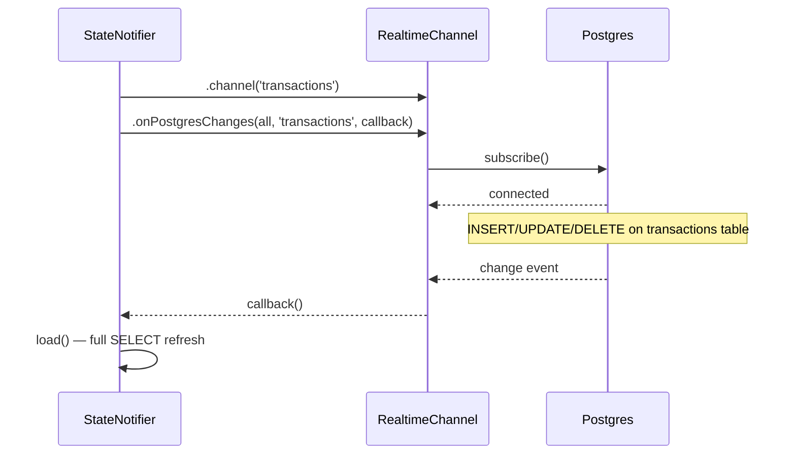

# API Reference

All backend interactions go through two interfaces:
1. **Supabase client SDK** (`supabase_flutter`) — table CRUD, RPCs, Realtime subscriptions
2. **Anthropic Claude API** — agent Q&A and categorization fallback

No custom backend server. Everything is client-to-service.

---

## Supabase Client

Initialised once at startup via `SupabaseService` singleton.

```dart
// lib/core/supabase.dart
await Supabase.initialize(
  url: dotenv.env['SUPABASE_URL'],
  publishableKey: dotenv.env['SUPABASE_ANON_KEY'],
);
```

Access throughout the app:

```dart
SupabaseService().client.from('transactions').select();
```

---

## Table Operations

### `transactions`

| Operation | Method | Code |
|---|---|---|
| List (paginated) | `SELECT` | `.from('transactions').select().order('created_at', ascending: false).limit(200)` |
| Insert | `INSERT` | `.from('transactions').insert(tx.toJson()).select()` |
| Update | `UPDATE` | `.from('transactions').update(tx.toJson()).eq('id', id)` |
| Soft delete | `UPDATE` | `.from('transactions').update({'is_deleted': true, 'deleted_at': DateTime.now().toIso8601String()}).eq('id', id)` |
| Filter by account | `SELECT` | `.from('transactions').select().eq('account_id', accountId)` |
| Filter by invoice | `SELECT` | `.from('transactions').select().eq('linked_invoice_id', invoiceId)` |
| Sum by type (30d) | `SELECT` | `.from('transactions').select('amount').eq('type', 'credit').gte('created_at', date)` |
| Duplicate check | `SELECT` | `.from('transactions').select('id').eq('raw_sms_hash', sha256(rawText)).maybeSingle()` |

### `goals`

| Operation | Method | Code |
|---|---|---|
| List | `SELECT` | `.from('goals').select().limit(100)` |
| Insert | `INSERT` | `.from('goals').insert(goal.toJson())` |
| Allocate | `UPDATE` | `.from('goals').update({'allocated_amount': newTotal}).eq('id', id)` |
| Get by type | `SELECT` | `.from('goals').select().eq('type', 'emergency_fund').single()` |

### `invoices`

| Operation | Method | Code |
|---|---|---|
| List | `SELECT` | `.from('invoices').select().order('created_at', ascending: false).limit(100)` |
| Insert | `INSERT` | `.from('invoices').insert(inv.toJson())` |
| Update | `UPDATE` | `.from('invoices').update(inv.toJson()).eq('id', id)` |
| Soft delete | `UPDATE` | `.from('invoices').update({'is_deleted': true}).eq('id', id)` |

### `category_rules`

| Operation | Method | Code |
|---|---|---|
| List (ordered) | `SELECT` | `.from('category_rules').select().order('priority', ascending: true)` |
| Insert | `INSERT` | `.from('category_rules').insert(rule.toJson())` |

### `accounts`

| Operation | Method | Code |
|---|---|---|
| List | `SELECT` | `.from('accounts').select()` |
| Insert | `INSERT` | `.from('accounts').insert(account.toJson())` |

### `recurring_expenses`

| Operation | Method | Code |
|---|---|---|
| List | `SELECT` | `.from('recurring_expenses').select()` |
| Agent context | `SELECT` | `.from('recurring_expenses').select('name, amount, frequency').eq('frequency', 'monthly')` |

### `recurring_income`

| Operation | Method | Code |
|---|---|---|
| List | `SELECT` | `.from('recurring_income').select()` |
| Agent context | `SELECT` | `.from('recurring_income').select('name, amount, frequency, next_expected')` |

### `monthly_snapshots`

| Operation | Method | Code |
|---|---|---|
| List (trend chart) | `SELECT` | `.from('monthly_snapshots').select().order('year', ascending: false).order('month', ascending: false).limit(12)` |
| Insert (monthly job) | `INSERT` | `.from('monthly_snapshots').insert(snapshot.toJson())` |

---

## RPC Functions

### `fn_account_balance(p_account_id)`

Returns the derived current balance for an account: `opening_balance + SUM(credits) - SUM(debits)` for all transactions after `opening_date`. Excludes transfers and investments, ignores soft-deleted rows.

```dart
final balance = await SupabaseService()
    .client
    .rpc('fn_account_balance', params: {'p_account_id': accountId});
```

Returns: `NUMERIC`

SQL:

```sql
CREATE OR REPLACE FUNCTION fn_account_balance(p_account_id uuid)
RETURNS NUMERIC AS $$
DECLARE
  ob NUMERIC;
  od DATE;
  tx_total NUMERIC;
BEGIN
  SELECT opening_balance, opening_date INTO ob, od
  FROM accounts WHERE id = p_account_id;

  SELECT COALESCE(SUM(CASE WHEN type = 'credit' THEN amount ELSE -amount END), 0)
  INTO tx_total
  FROM transactions
  WHERE account_id = p_account_id
    AND type IN ('debit', 'credit')
    AND is_deleted = false
    AND (od IS NULL OR created_at >= od);

  RETURN ob + tx_total;
END;
$$ LANGUAGE plpgsql;
```

### `fn_net_worth()`

Returns sum of `fn_account_balance()` across all accounts. One call, no client-side aggregation needed.

```dart
final netWorth = await SupabaseService().client.rpc('fn_net_worth');
```

Returns: `NUMERIC`

```sql
CREATE OR REPLACE FUNCTION fn_net_worth()
RETURNS NUMERIC AS $$
DECLARE
  total NUMERIC;
BEGIN
  SELECT COALESCE(SUM(fn_account_balance(id)), 0) INTO total
  FROM accounts
  WHERE is_deleted = false;
  RETURN total;
END;
$$ LANGUAGE plpgsql;
```

---

## Realtime Channels

Subscriptions use Supabase Realtime (`PostgresChanges`). Each provider opens one channel on `load()`.



| Channel name | Table | Provider | Created in |
|---|---|---|---|
| `'transactions'` | `transactions` | `TransactionNotifier` | `transactionProvider` (Riverpod) |
| `'goals'` | `goals` | `GoalNotifier` | `goalProvider` |
| `'invoices'` | `invoices` | `InvoiceNotifier` | `invoiceProvider` |

All channels auto-unsubscribe on provider disposal via `ref.onDispose()`.

---

## Claude API

### Endpoint

```
POST https://api.anthropic.com/v1/messages
```

### Headers

```
Content-Type: application/json
x-api-key: {CLAUDE_API_KEY}
anthropic-version: 2023-06-01
```

### Request Body

```json
{
  "model": "claude-sonnet-4-20250514",
  "max_tokens": 1024,
  "system": "You are a financial assistant. The user has provided their financial data below. Answer their question using only this data. Be concise and specific.",
  "messages": [
    {
      "role": "user",
      "content": "Here is my current financial data:\n\nCurrent balance: 45000\nLast 30 days - Earned: 120000, Spent: 85000\nTotal transactions: 47+\nInvoices - Total invoiced: $3200, Total received: $2800\nGoal \"Emergency Fund\": 15% funded\n\nQuestion: Can I afford a new keyboard?"
    }
  ]
}
```

### Response

```json
{
  "content": [
    {
      "type": "text",
      "text": "Your current balance is ₹45,000..."
    }
  ]
}
```

### Data Gathering (Client-Side)

Before each agent request, the app gathers context by calling Supabase:

| Data point | Source |
|---|---|
| Per-account balance | `fn_account_balance(account_id)` RPC |
| Net worth | `fn_net_worth()` RPC |
| 30d earned + spent | Two `SELECT SUM` queries on `transactions` |
| Transaction count | `SELECT count(*)` on `transactions` |
| Invoice summary | `SELECT` all invoices, compute totals client-side |
| Goal progress | `SELECT` all goals, compute percentages client-side |
| Recurring expenses | `SELECT` from `recurring_expenses` (v2) |
| Expected income | `SELECT` from `recurring_income` (v2) |

The gathered data is serialised into a text block and injected as context. No tool-use pattern yet — Claude receives the data pre-fetched.

---

## Error Handling

All Supabase operations wrapped in try-catch at the provider level:

```dart
try {
  await SupabaseService().client.from('transactions').insert(tx.toJson());
} catch (e) {
  state = AsyncValue.error(e, st);
  // UI shows error state with retry button
}
```

Claude API errors surfaced as chat bubble: `"Sorry, I could not process that: {error}"`

---

## Model Serialisation Mapping

Each Dart model maps its fields to snake_case JSON for Supabase.

| Dart field | JSON key | Example |
|---|---|---|
| `amount` | `amount` | `1200.50` |
| `createdAt` | `created_at` | `2026-06-24T10:00:00Z` |
| `targetAmount` | `target_amount` | `300000` |
| `allocatedAmount` | `allocated_amount` | `45000` |
| `invoicedUsd` | `invoiced_usd` | `500.00` |
| `receivedPaypal` | `received_paypal` | `485.00` |
| `matchPattern` | `match_pattern` | `"swiggy"` |
| `rawSmsHash` | `raw_sms_hash` | `sha256-hash-string` |
| `linkedInvoiceId` | `linked_invoice_id` | `uuid-string` |
| `transferGroupId` | `transfer_group_id` | `uuid-string` |
| `isDeleted` | `is_deleted` | `false` |
| `editHistory` | `edit_history` | `[{"old":{...},"new":{...}}]` |
