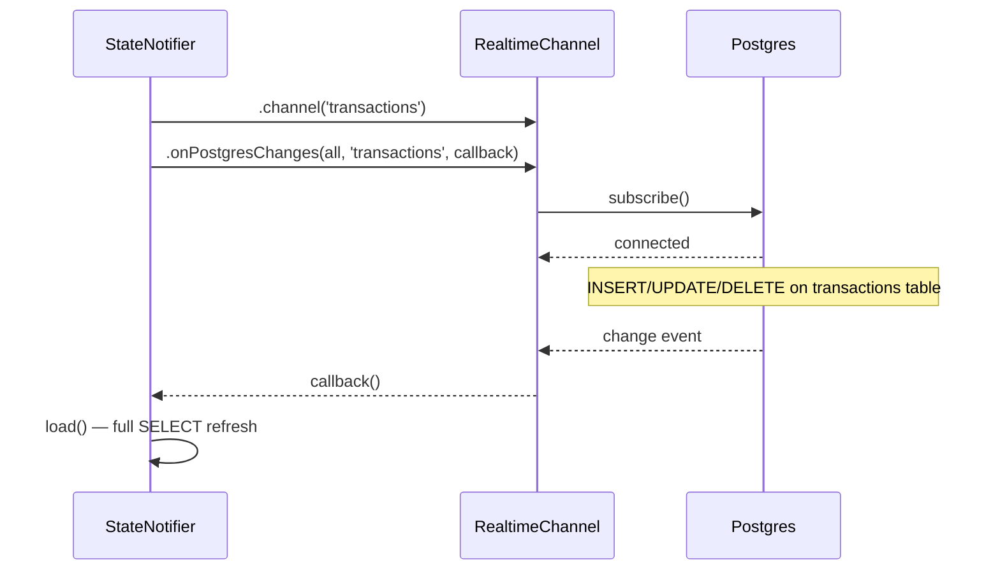

# API Reference

All backend interactions go through two interfaces:
1. **Supabase client SDK** (`supabase_flutter`) — authenticated table reads,
   RPCs, and Realtime subscriptions.
2. **Supabase Edge Function** (`/functions/v1/agent`) — authenticated Agent Desk
   Q&A; it owns Gemini and its read-only tool loop.

The implementation requires owner-scoped Auth/RLS migrations and a deployed
Edge Function. The browser never receives `GEMINI_API_KEY`.

---

## Supabase Client

Initialised once at startup via `SupabaseService` singleton.

```dart
// lib/core/supabase.dart
await Supabase.initialize(
  url: dotenv.env['SUPABASE_URL'],
  publishableKey: dotenv.env['SUPABASE_ANON_KEY'],
);
```

Access throughout the app:

```dart
SupabaseService().client.from('transactions').select();
```

---

## Table Operations

### `transactions`

| Operation | Method | Code |
|---|---|---|
| List | `get_transaction_page` RPC | Cursor-paginated owner ledger used by `ledgerProvider`; filters/search execute in SQL. |
| Insert / update debit or credit | `save_transaction_with_labels` RPC | Atomic fields, attached labels, and primary label. An unlabelled expense is valid. |
| Soft delete | `UPDATE` | `.from('transactions').update({'is_deleted': true, 'deleted_at': DateTime.now().toIso8601String()}).eq('id', id)` |
| Filter by account | `SELECT` | `.from('transactions').select().eq('account_id', accountId)` |
| Filter by invoice | `SELECT` | `.from('transactions').select().eq('linked_invoice_id', invoiceId)` |
| Duplicate check (SMS-sourced) | `SELECT` | `.from('transactions').select('id').eq('raw_sms_hash', sha256(rawText)).maybeSingle()` |

### `goals`

| Operation | Method | Code |
|---|---|---|
| List | `SELECT` | `.from('goals').select().eq('is_deleted', false).limit(100)` |
| Insert | `INSERT` | `.from('goals').insert(goal.toJson())` |
| Allocate / correct | `contribute_to_goal` RPC | Appends a contribution and maintains the total atomically. |
| Reallocate | `reallocate_goal_funds` RPC | Paired contribution changes in one transaction. |
| Edit / status / delete | `update_goal`, `set_goal_status`, `delete_goal` RPCs | Enforces target, overfund, and safe-delete guards. |
| Soft delete | `UPDATE` | `.from('goals').update({'is_deleted': true, 'deleted_at': ...}).eq('id', id)` |

### `invoices`

| Operation | Method | Code |
|---|---|---|
| List | `SELECT` | `.from('invoices').select().order('created_at', ascending: false).limit(100)` |
| Insert | `INSERT` | `.from('invoices').insert(inv.toJson())` |
| Update | `UPDATE` | `.from('invoices').update(inv.toJson()).eq('id', id)` |
| Soft delete | `UPDATE` | `.from('invoices').update({'is_deleted': true}).eq('id', id)` |

### `category_rules`

| Operation | Method | Code |
|---|---|---|
| List (ordered) | `SELECT` | `.from('category_rules').select().order('priority', ascending: true)` |
| Insert | `INSERT` | `.from('category_rules').insert(rule.toJson())` |

### `accounts`

| Operation | Method | Code |
|---|---|---|
| List | `SELECT` | `.from('accounts').select()` |
| Insert | `INSERT` | `.from('accounts').insert(account.toJson())` |

### `recurring_expenses`

| Operation | Method | Code |
|---|---|---|
| List | `SELECT` | `.from('recurring_expenses').select()` |
| Agent context | `SELECT` | `.from('recurring_expenses').select('name, amount, frequency').eq('frequency', 'monthly')` |

### `recurring_income`

| Operation | Method | Code |
|---|---|---|
| List | `SELECT` | `.from('recurring_income').select()` |
| Agent context | `SELECT` | `.from('recurring_income').select('name, amount, frequency, next_expected')` |

### `monthly_snapshots`

| Operation | Method | Code |
|---|---|---|
| List (trend chart) | `SELECT` | `.from('monthly_snapshots').select().order('year', ascending: false).order('month', ascending: false).limit(12)` |
| Insert (monthly job) | `INSERT` | `.from('monthly_snapshots').insert(snapshot.toJson())` |

---

## RPC Functions

### `fn_account_balance(p_account_id)`

Returns the derived current balance for an account: `opening_balance + SUM(inflows) - SUM(outflows)` for transactions after `opening_date`. Since migration `00004` it uses the explicit `direction` column (not `type`), so transfer and investment legs are balanced correctly per account. Uses `COALESCE(transacted_at, created_at)` for the date filter so backdated entries count correctly. Ignores soft-deleted rows.

```dart
final balance = await SupabaseService()
    .client
    .rpc('fn_account_balance', params: {'p_account_id': accountId});
```

Returns: `NUMERIC`

SQL (current, migration `00004`):

```sql
CREATE OR REPLACE FUNCTION fn_account_balance(p_account_id uuid)
RETURNS NUMERIC AS $$
DECLARE
  ob NUMERIC;
  od DATE;
  tx_total NUMERIC;
BEGIN
  SELECT opening_balance, opening_date INTO ob, od
  FROM accounts WHERE id = p_account_id;

  SELECT COALESCE(
    SUM(CASE WHEN direction = 'inflow' THEN amount ELSE -amount END),
    0
  )
  INTO tx_total
  FROM transactions
  WHERE account_id = p_account_id
    AND is_deleted = false
    AND (od IS NULL OR COALESCE(transacted_at, created_at) >= od);

  RETURN COALESCE(ob, 0) + tx_total;
END;
$$ LANGUAGE plpgsql;
```

### `fn_net_worth()`

Returns sum of `fn_account_balance()` across all accounts. One call, no client-side aggregation needed.

```dart
final netWorth = await SupabaseService().client.rpc('fn_net_worth');
```

Returns: `NUMERIC`

```sql
CREATE OR REPLACE FUNCTION fn_net_worth()
RETURNS NUMERIC AS $$
DECLARE
  total NUMERIC;
BEGIN
  SELECT COALESCE(SUM(fn_account_balance(id)), 0) INTO total
  FROM accounts
  WHERE is_deleted = false;
  RETURN total;
END;
$$ LANGUAGE plpgsql;
```

---

## Realtime Channels

Subscriptions use Supabase Realtime (`PostgresChanges`). Each provider opens one channel on `load()`.


```mermaid
sequenceDiagram
    participant Provider as StateNotifier
    participant Channel as RealtimeChannel
    participant Postgres

    Provider->>Channel: .channel('transactions')
    Provider->>Channel: .onPostgresChanges(all, 'transactions', callback)
    Channel->>Postgres: subscribe()
    Postgres-->>Channel: connected

    Note over Postgres: INSERT/UPDATE/DELETE on transactions table

    Postgres-->>Channel: change event
    Channel-->>Provider: callback()
    Provider->>Provider: load() — full SELECT refresh
```

| Channel name | Table(s) | Provider | Created in |
|---|---|---|---|
| `'transactions'` | `transactions` + `transaction_labels` | `TransactionNotifier` | `transactionProvider` (Riverpod) |
| `'accounts'` | `accounts` | `AccountNotifier` | `accountProvider` |
| `'labels'` | `labels` | `LabelNotifier` | `labelProvider` |
| `'goals'` | `goals` | `GoalNotifier` | `goalProvider` |
| `'invoices'` | `invoices` | `InvoiceNotifier` | `invoiceProvider` |

All channels auto-unsubscribe on provider disposal via `ref.onDispose()`.

Every event currently triggers a full `load()` refresh (**defect D4**); Phase 7
replaces this with row-level patching or debounced targeted invalidation.

---

## Agent Edge Function

`POST /functions/v1/agent` accepts the current owner's visible conversation and
returns an answer plus a correlation ID. The function validates the JWT and
`app_is_owner()`, then calls Gemini 2.5 Flash and executes up to 10 server-side,
read-only tool rounds. It limits requests to 60 messages and 128 KiB.

The function returns stable error codes including `unauthorized`, `not_owner`,
`invalid_request`, and `server_misconfigured`; callers should surface its safe
message and correlation ID rather than backend details. No Agent tool can
insert, update, delete, allocate, or move money.

---

## Owner-scoped interfaces

| Interface | Purpose |
|---|---|
| `save_transaction_with_labels(...)` RPC | Atomic debit/credit fields + label joins + primary label |
| Label lifecycle RPCs | Identity-preserving rename, archive, merge, restore, and guarded soft-delete |
| Goal RPCs | Contribution history, reallocation, edit, status, and guarded delete |
| `get_briefing_summary`, `get_account_balances`, `get_label_usage` | Canonical aggregate data |
| `get_transaction_page` | Keyset-paginated ledger query |
| `get_analytics`, `fn_net_worth_asof`, `fn_account_balance_asof` | Analytics and bounded historical balances |
| `confirm_obligation`, `get_forecast_inputs` | Obligation settlement and reproducible forecast inputs |
| `get_top_merchants` | Alias-normalized top-merchant results |

All planned RPCs derive the owner from `auth.uid()`, fail closed for
anonymous/non-owner callers, exclude soft-deleted rows, and follow the metric
definitions in `docs/PRD.md` §4.

---

## Error Handling

All Supabase operations wrapped in try-catch at the provider level:

```dart
try {
  await SupabaseService().client.from('transactions').insert(tx.toJson());
} catch (e) {
  state = AsyncValue.error(e, st);
  // UI shows error state with retry button
}
```

Gemini API errors surfaced as a chat bubble: `"Sorry, I could not process that: {error}"`

---

## Model Serialisation Mapping

Each Dart model maps its fields to snake_case JSON for Supabase.

| Dart field | JSON key | Example |
|---|---|---|
| `amount` | `amount` | `1200.50` |
| `createdAt` | `created_at` | `2026-06-24T10:00:00Z` |
| `targetAmount` | `target_amount` | `300000` |
| `allocatedAmount` | `allocated_amount` | `45000` |
| `invoicedUsd` | `invoiced_usd` | `500.00` |
| `receivedPaypal` | `received_paypal` | `485.00` |
| `matchPattern` | `match_pattern` | `"swiggy"` |
| `rawSmsHash` | `raw_sms_hash` | `sha256-hash-string` |
| `linkedInvoiceId` | `linked_invoice_id` | `uuid-string` |
| `transferGroupId` | `transfer_group_id` | `uuid-string` |
| `transactedAt` | `transacted_at` | `2026-06-27T14:30:00Z` or null |
| `isDeleted` | `is_deleted` | `false` |
| `editHistory` | `edit_history` | `[{"old":{...},"new":{...}}]` |

---

## Owner-scoped RPC reference (Phases 5–10)

Every function below derives the owner from `auth.uid()`, checks `app_is_owner()`,
runs with a fixed `search_path`, and is granted to `authenticated` only. None
accepts a caller-supplied owner id. Envelope-returning functions carry a
`version` field; a client that does not recognise the version must fail rather
than read the payload.

### Transactions & labels (`00013`, `00016`)

| Function | Args | Returns | Notes |
|---|---|---|---|
| `save_transaction_with_labels` | `p_id uuid?`, `p_fields jsonb`, `p_label_ids uuid[]`, `p_primary_label uuid?` | `uuid` | Create/edit + label-set replacement + one `edit_history` entry, atomically. A **labelled** expense must name one attached primary; an unlabelled expense is valid (`Unlabeled`). Preserves `raw_sms`/`raw_sms_hash`. |
| `rename_label` | `p_id`, `p_name` | `void` | Identity-preserving; case-insensitive conflict; case-only rename allowed. |
| `set_label_status` | `p_id`, `p_status` | `void` | `active`/`archived` (restore/archive). |
| `merge_labels` | `p_source`, `p_target` | `void` | Moves all references, resolves duplicate joins, marks source `merged`. Idempotent. |
| `delete_label` | `p_id` | `void` | Soft-delete only when unreferenced; else raises (archive/merge instead). |

### Ledger & aggregates (`00017`)

| Function | Args | Returns | Notes |
|---|---|---|---|
| `get_transaction_page` | limit, cursor (`at`,`id`), account, label, type, search, from, to, unresolved | `{version, rows[], has_more, next_cursor}` | Keyset pagination on `(COALESCE(transacted_at,created_at) DESC, id DESC)`. Page size clamped ≤ 100. `unresolved` ∈ `needs_primary`/`unlabeled`. |
| `get_briefing_summary` | `p_month?`, `p_year?` | `{version, income, total_outflow, family_support, personal_spend, net_cash_surplus, investments, savings_rate, needs_primary_count, unlabeled_count}` | `personal_spend = total_outflow − family_support` by construction. |
| `get_account_balances` | — | `{version, accounts[]}` | Batched; replaces one `fn_account_balance` per account. |
| `get_label_usage` | — | `{version, labels[{label_id, attached_count, primary_count, attributed_amount}]}` | Whole-ledger, not per-page. |

### Analytics & net worth (`00018`)

| Function | Args | Returns | Notes |
|---|---|---|---|
| `get_analytics` | `p_months`, `p_include_family` | `{version, cash_flow[], by_label[], daily_spend[], net_worth[], net_worth_current, top_merchants[]}` | The four charts + top merchants in one call. Net-worth points on the legacy basis are `available:false`. |
| `fn_net_worth_asof` / `fn_account_balance_asof` | `p_as_of` | `numeric` | Bounded to a cut-off; fixes the snapshot leak. |

### Goals (`00014`, `00015`)

`contribute_to_goal(p_goal_id, p_amount, p_note?, p_allow_overfunding?)`,
`reallocate_goal_funds(p_from, p_to, p_amount, p_note?, p_allow_overfunding?)`,
`update_goal(...)`, `set_goal_status`, `delete_goal`, `assert_goal_allocation_drift()`.
Allocation is earmarking — none of these touch an account balance or net worth.

### Obligations & merchants (`00019`, `00020`)

| Function | Args | Returns | Notes |
|---|---|---|---|
| `confirm_obligation` | `p_kind`, `p_id`, `p_transaction_id` | `date` | Links the settling ledger row and advances the due date atomically. |
| `get_forecast_inputs` | `p_lookback_days` | `{version, liquid_balance, investment_balance, earmarked_total, personal_spend_per_day, ...}` | Measured inputs only; the projection is computed client-side and reproducible by hand. |
| `get_top_merchants` | `p_months`, `p_limit` | `{version, merchants[]}` | Rolls up by `app_canonical_merchant`; raw merchant on the row is untouched. |

### Edge Function

`POST /functions/v1/agent` — requires an owner JWT; the function calls
`app_is_owner()` itself and returns `not_owner` (403) otherwise. All Gemini
traffic is server-side; the browser never sees `GEMINI_API_KEY`. Read-only
tools; no tool can create, modify, or move money.

## Lifecycle events (Phase 11.3)

Versioned `CustomEvent`s between `web/flutter_bootstrap.js` and Dart
(`protocol: 1`):

| Event | Direction | When |
|---|---|---|
| `md-dart-ready` | Dart → JS | After the first frame paints. Hides the boot surface. |
| `md-resume-request` | JS → Dart | On `visibilitychange`/`pageshow`/`webglcontextlost`. Carries `attemptId`. |
| `md-resume-ack` | Dart → JS | After the next frame renders for that `attemptId`. |

No ack within 3s → one cache-busting reload → a second failure shows the manual
recovery surface. Timings are logged by event name only.
