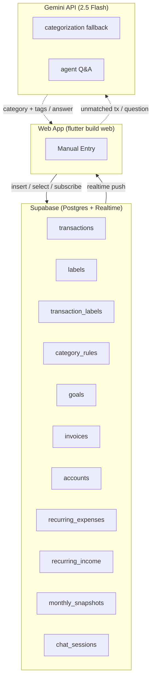
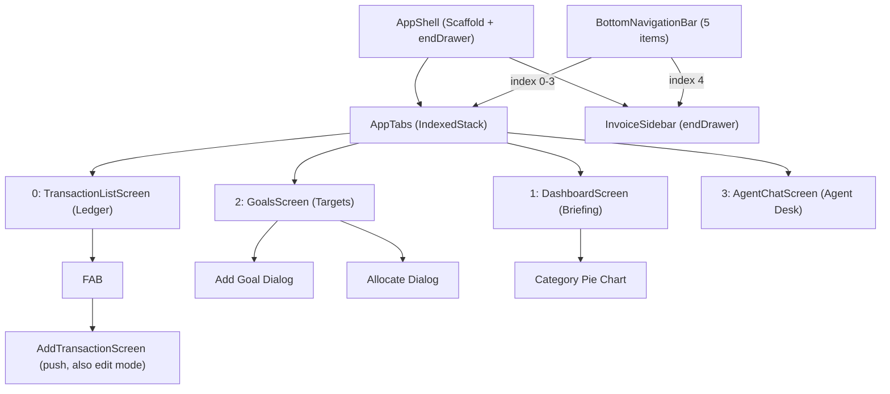
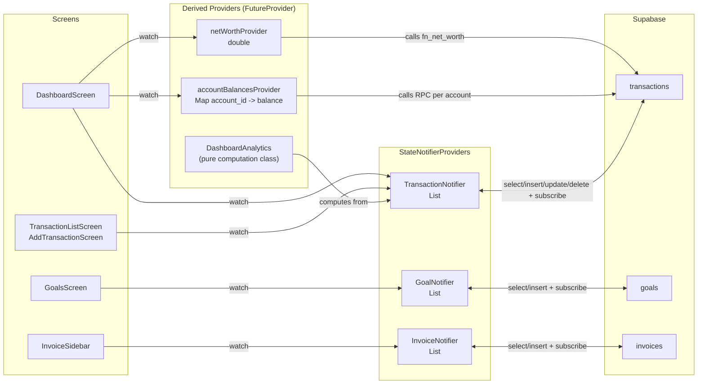
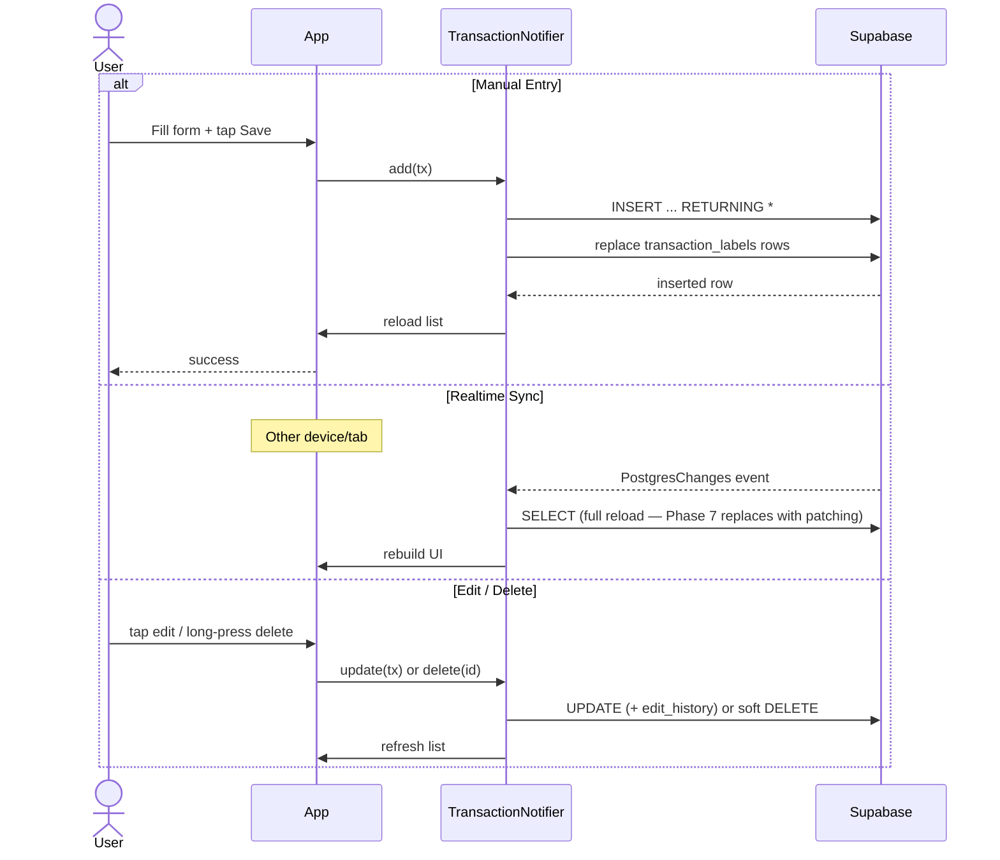
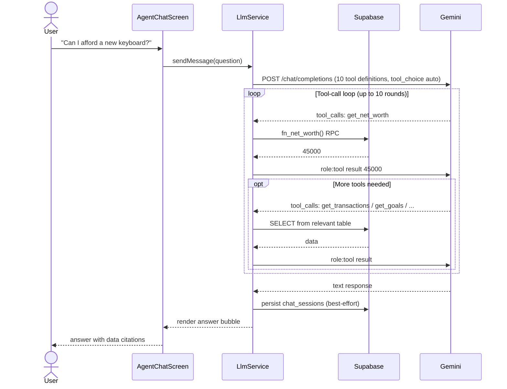

# Architecture

Flutter web personal finance app backed by Supabase (Postgres + Realtime) with a Gemini-powered finance agent.

---

## System Overview

---

## Navigation Structure

5 bottom nav items (labels as shipped):
- Ledger (index 0, FAB visible; card edit button pushes `AddTransactionScreen` in edit mode)
- Briefing (index 1)
- Targets (index 2)
- Agent Desk (index 3)
- Invoices (index 4 — opens end drawer instead of switching tab)

**Planned (Phase 8):** Analytics becomes the fifth primary destination; invoice
access moves to an app-bar/drawer action so the bar stays at five items.

---

## State Management

All state managed by Riverpod `StateNotifierProvider`.

Each provider:
1. Calls `load()` on creation (SELECT with order, no limit — all non-deleted rows)
2. Subscribes to Realtime channel (pushes trigger `load()` on change)
3. Exposes `add()`, `update()`, `delete()` that call Supabase then refresh local state

The `DashboardScreen` uses a `WidgetsBindingObserver` to call `_refresh()` on mount and app resume — invalidating all account/balance providers and reloading the transaction provider so metrics are always fresh.

---

## Data Flow: Transaction Lifecycle

Transfers and investments insert **two linked legs** (`transfer_group_id`,
explicit `direction` per leg) via `addTransfer`/`addInvestment`.

**Planned (Phase 5):** the update path (separate field UPDATE + label
replacement) is replaced by one `save_transaction_with_labels` RPC that writes
fields, labels, and primary label atomically with a single audit entry.

---

## Data Flow: Agent Q&A

Agent uses the **tool-call pattern** — Gemini decides which of the 10 read-only
tools to call each turn (`gemini-2.5-flash` via the OpenAI-compatible
endpoint). No tool can modify data.

**Planned (Phase 3):** this entire loop moves into an authenticated Supabase
Edge Function; the browser sends only the conversation and receives the answer
plus privacy-safe tool-activity metadata. `GEMINI_API_KEY` leaves the client
bundle and is rotated.

---

## Parsing and Classification (dormant)

Native SMS capture was **removed** with the Android runner; the app is
web-only. Two building blocks are retained for the Phase 10 quick-capture
feature and remain unused at runtime today:

- `lib/features/sms/sms_parser.dart` — pure Dart regex parser for UPI-style
  bank messages (future paste/import parsing).
- `category_rules` table + `CategoryRule` model — priority-ordered matching
  engine, dormant since labels replaced categories/tags (migration `00005`).

**Planned (Phase 10):** quick capture parses one-field input (`250 biryani
cash`) deterministically first (amount token, account-name match, label
keywords), with Gemini as fallback — always producing a reviewable draft,
never a silent save.

---

## Key Architecture Decisions

| Decision | Choice | Rationale |
|---|---|---|
| State management | Riverpod (StateNotifier) | Simple, no codegen, testable. Locked — no second state system. |
| Navigation | IndexedStack + bottom nav | Preserves tab state, fast switching |
| Invoice access | End drawer via 5th nav item | No dedicated screen needed (moves to app-bar action when Analytics takes the slot, Phase 8) |
| Data sync | Supabase Realtime (PostgresChanges) | Sub-second cross-device, no polling. Full-reload handler is defect D4; row patching planned (Phase 7). |
| SMS integration | Removed (web-only); pure Dart parser retained | Feeds future quick-capture/paste parsing, not runtime capture |
| Agent approach | Gemini tool-calls (10 read-only tools) | Model decides which queries to run per turn — no pre-fetching. Browser-direct today; Edge Function planned (Phase 3). |
| Agent model | `gemini-2.5-flash` via OpenAI-compatible endpoint | Single model; no switcher |
| Transaction dates | `transacted_at` (user-set) + `created_at` (server) | `transacted_at` is the actual money-move date; falls back to `created_at` for display/balance calculation |
| Ledger direction | `direction` column (`inflow`/`outflow`) | Independent of `type` — the RPC uses `direction` directly so transfer/investment legs balance correctly. Model helpers `isInflow`/`isOutflow` fall back to `type` for backward compatibility. |
| Account selection | Explicit, required, always visible in forms | Cash spends must hit Cash, bank spends the selected bank; never a silent default (PRD §5.1) |
| Dashboard refresh | `WidgetsBindingObserver` + `ref.invalidate()` | On mount and app resume, all providers are invalidated so metrics reflect the latest DB state. Pull-to-refresh also reloads the transaction provider. |
| Dashboard analytics | `DashboardAnalytics.fromTransactions()` | Pure computation over the full ledger — replaced by aggregate RPCs + canonical metrics in Phases 7–8 (its even multi-label split is defect D3) |
| Auth | None today (single anon key) — **being replaced** | Single-owner Supabase Auth + owner-only RLS is Phase 2; open policies are defect D5, not an accepted end state |
| Charts | fl_chart | Locked — no second chart library. Analytics is capped at four primary charts (PRD §8). |

---

## Planned Architecture Changes (summary)

In dependency order (details in `docs/enhancement.md` / `docs/TODO.md`):

1. **Auth gate** wrapping the app shell: session restore → owner check →
   finance providers. Fail-closed for non-owners.
2. **Supabase Edge Function** for Agent Desk (the only new infrastructure).
3. **Correctness layer:** explicit-account enforcement + Family Support flag,
   primary labels with one transactional save RPC, goal contributions.
4. **Data layer:** cursor-paginated ledger, row-level Realtime patching,
   aggregate RPCs (`get_briefing_summary`, `get_analytics`,
   `get_account_balances`), monthly + account-balance snapshots.
5. **Presentation:** numbers-only Briefing; separate Analytics tab with exactly
   four charts; lazy tab initialization.
 6. **Web platform:** `flutter_bootstrap.js` startup surface, browser-agnostic
    JS/Dart resume handshake with bounded WebGL-context-loss recovery, 24-hour
    local drafts (installed-PWA resume reliability for the mobile Brave
    shortcut; Brave on desktop + Helium/Zen possible future browsers — no
    native app).
