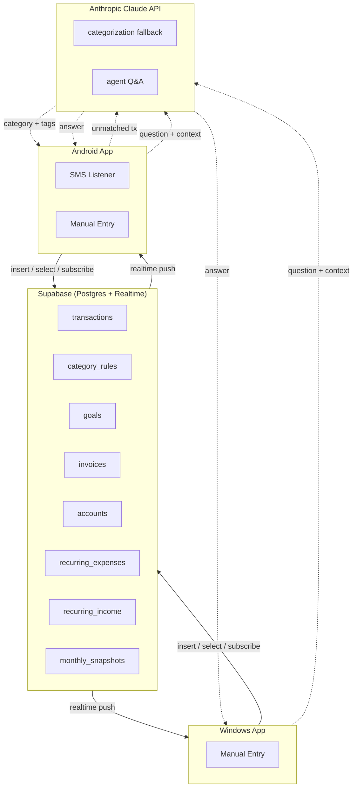
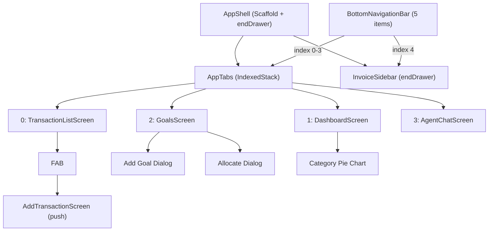
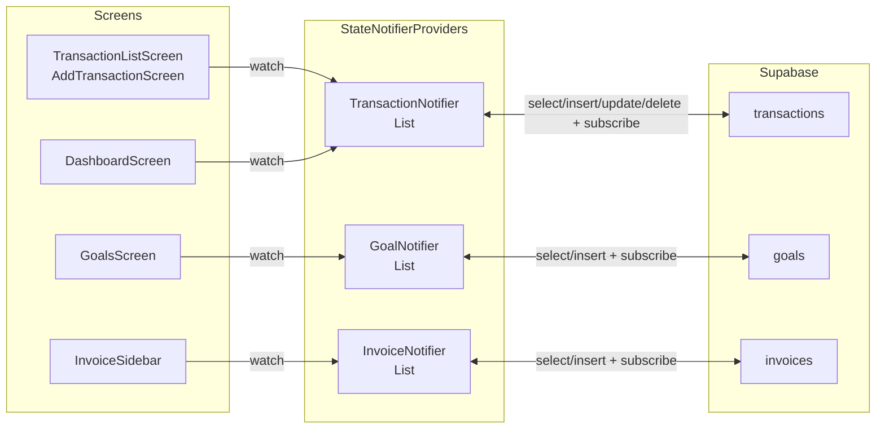
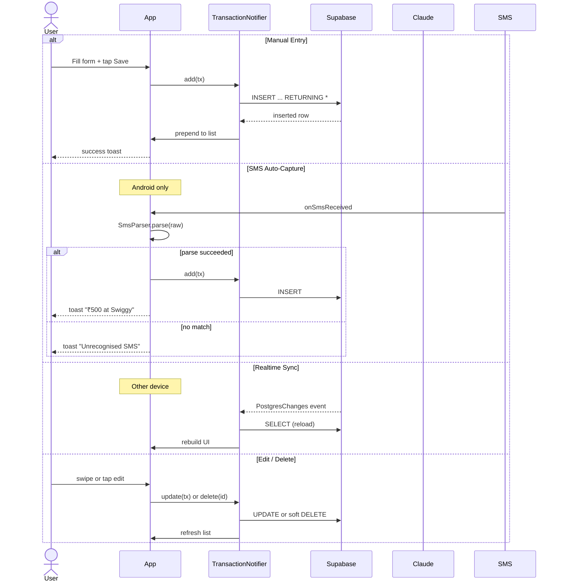
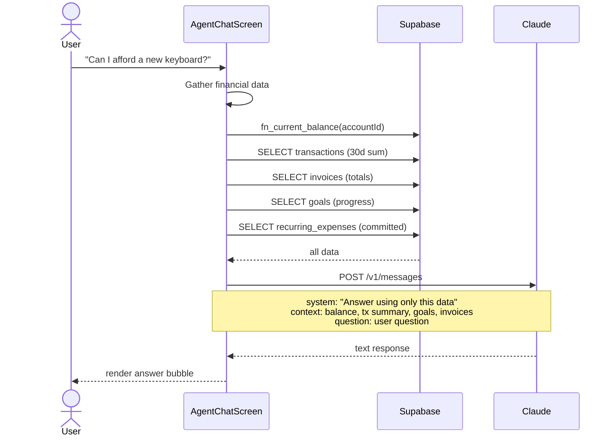
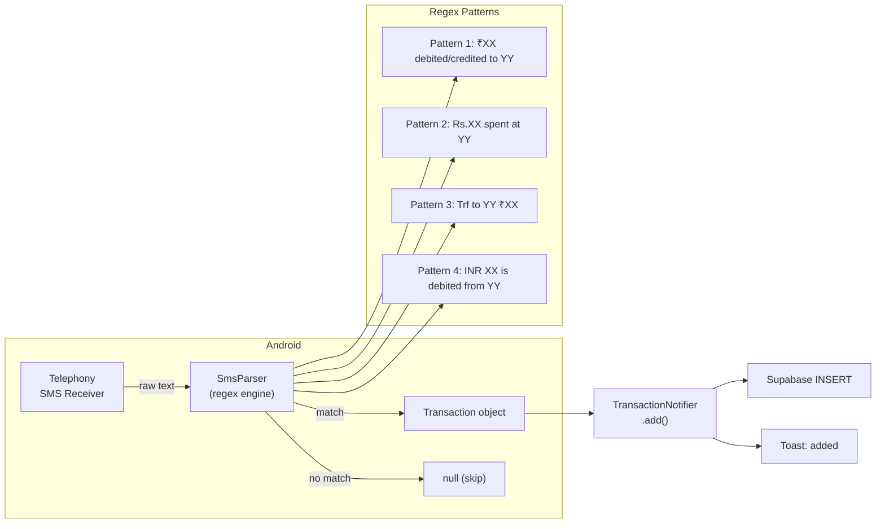
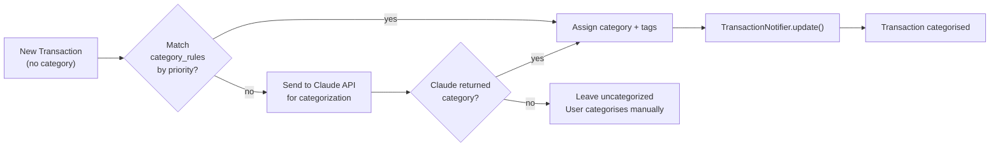

# Architecture

Cross-platform Flutter app backed by Supabase (Postgres + Realtime) with a Claude-powered finance agent.

---

## System Overview

---

## Navigation Structure

5 bottom nav items:
- Transactions (index 0, FAB visible)
- Dashboard (index 1)
- Goals (index 2)
- Agent (index 3)
- Invoices (index 4 — opens end drawer instead of switching tab)

---

## State Management

All state managed by Riverpod `StateNotifierProvider`.

Each provider:
1. Calls `load()` on creation (SELECT with order + limit)
2. Subscribes to Realtime channel (pushes trigger `load()` on change)
3. Exposes `add()`, `update()`, `delete()` that call Supabase then refresh local state

---

## Data Flow: Transaction Lifecycle

---

## Data Flow: Agent Q&A

Current implementation uses **context injection** — data is gathered client-side and sent as context. Future upgrade to **tool-use pattern** where Claude decides which queries to run.

---

## SMS Pipeline

---

## Categorization Pipeline

---

## Key Architecture Decisions

| Decision | Choice | Rationale |
|---|---|---|
| State management | Riverpod (StateNotifier) | Simple, no codegen, testable |
| Navigation | IndexedStack + bottom nav | Preserves tab state, fast switching |
| Invoice access | End drawer via 5th nav item | No dedicated screen needed |
| Data sync | Supabase Realtime (PostgresChanges) | Sub-second cross-device, no polling |
| SMS integration | Stub + plugin | Real device needed, deferred |
| Agent approach | Context injection (v1) | Simpler than tool-use, ships faster |
| No auth | Single anon key | Personal tool, 2 devices max |
| Charts | fl_chart | Pie + line, battle-tested Flutter lib |
