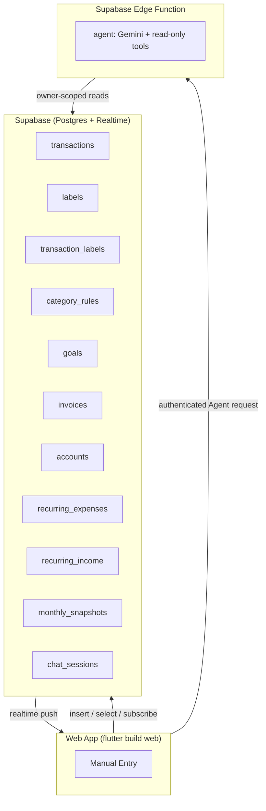
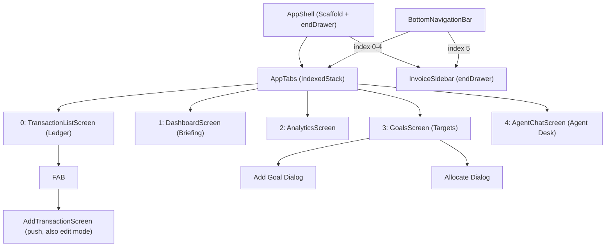
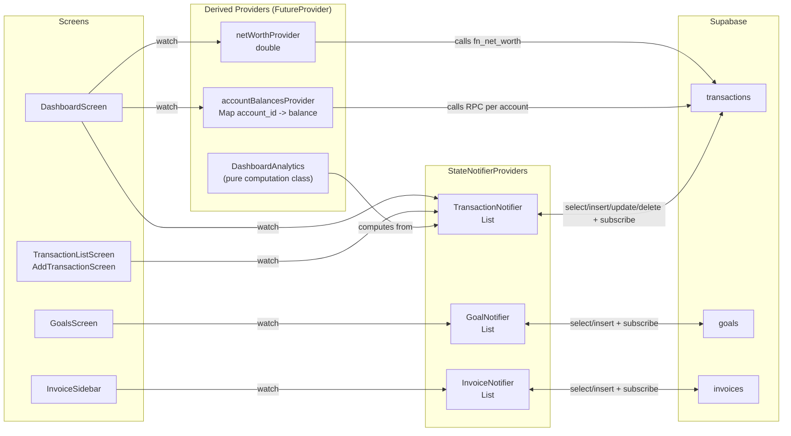
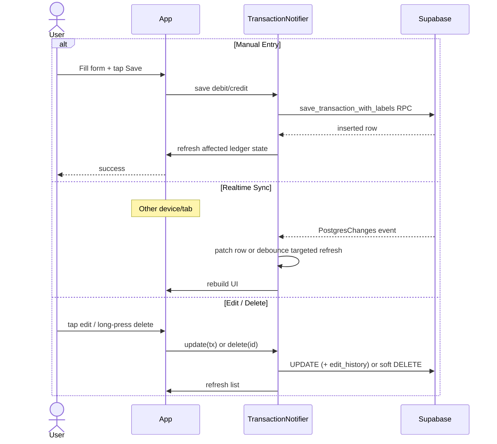
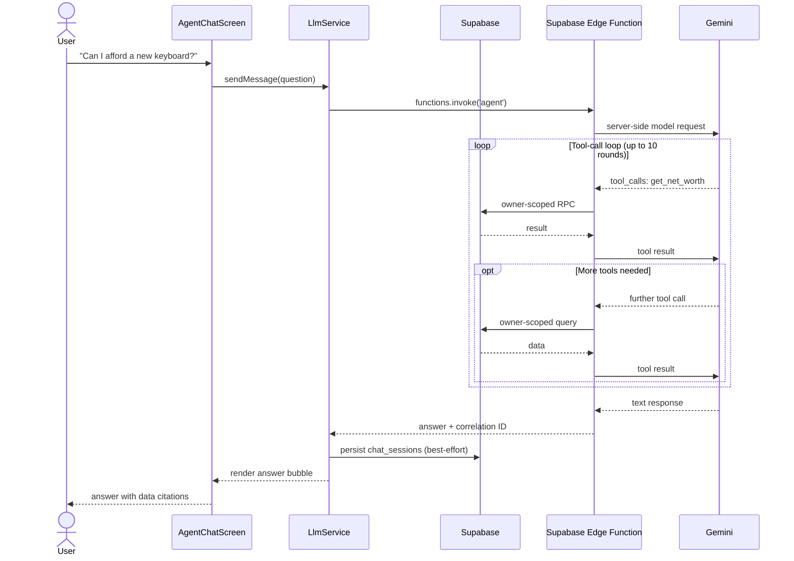

# Architecture

Flutter web personal finance app backed by Supabase (Postgres + Realtime) with a Gemini-powered finance agent.

---

## System Overview

```mermaid
graph TB
    subgraph WebApp["Web App (flutter build web)"]
        ME["Manual Entry"]
    end

    subgraph Supabase["Supabase (Postgres + Realtime)"]
        TX[transactions]
        LB[labels]
        TL[transaction_labels]
        CR[category_rules]
        GL[goals]
        IV[invoices]
        AC[accounts]
        RE[recurring_expenses]
        RI[recurring_income]
        MS[monthly_snapshots]
        CS[chat_sessions]
    end

    subgraph Edge["Supabase Edge Function"]
        AGT[agent: Gemini + read-only tools]
    end

    WebApp -->|insert / select / subscribe| Supabase
    Supabase -->|realtime push| WebApp

    WebApp -->|authenticated Agent request| Edge
    Edge -->|owner-scoped reads| Supabase
```

---

## Navigation Structure

```mermaid
graph TD
    AppShell["AppShell (Scaffold + endDrawer)"] --> AppTabs["AppTabs (IndexedStack)"]
    AppShell --> InvoiceSidebar["InvoiceSidebar (endDrawer)"]

    AppTabs --> Tab0["0: TransactionListScreen (Ledger)"]
    AppTabs --> Tab1["1: DashboardScreen (Briefing)"]
    AppTabs --> Tab2["2: AnalyticsScreen"]
    AppTabs --> Tab3["3: GoalsScreen (Targets)"]
    AppTabs --> Tab4["4: AgentChatScreen (Agent Desk)"]

    Tab0 --> FAB["FAB"] --> AddTx["AddTransactionScreen (push, also edit mode)"]
    Tab3 --> AddGoal["Add Goal Dialog"]
    Tab3 --> Allocate["Allocate Dialog"]

    BottomNav["BottomNavigationBar"] -->|index 0-4| AppTabs
    BottomNav -->|index 5| InvoiceSidebar
```

The shell lazily builds five `IndexedStack` tabs:
- Ledger (index 0, FAB visible; card edit button pushes `AddTransactionScreen` in edit mode)
- Briefing (index 1)
- Analytics (index 2)
- Targets (index 3)
- Agent Desk (index 4)

Invoices still appear as a sixth bottom-navigation item and open the end drawer.
This is an outstanding deviation from the five-destination product boundary.

---

## State Management

State uses Riverpod `StateNotifierProvider`, `FutureProvider.family`, and
`StateProvider` according to the data shape.

```mermaid
graph LR
    subgraph Providers["StateNotifierProviders"]
        TN["TransactionNotifier<br/>List<Transaction>"]
        GN["GoalNotifier<br/>List<Goal>"]
        IN["InvoiceNotifier<br/>List<Invoice>"]
    end

    subgraph Derived["Derived Providers (FutureProvider)"]
        AB["accountBalancesProvider<br/>Map account_id -> balance"]
        NW["netWorthProvider<br/>double"]
        DA["DashboardAnalytics<br/>(pure computation class)"]
    end

    subgraph Supabase["Supabase"]
        TXT[transactions]
        GLT[goals]
        IVT[invoices]
    end

    subgraph Screens["Screens"]
        TLS["TransactionListScreen<br/>AddTransactionScreen"]
        DS["DashboardScreen"]
        GS["GoalsScreen"]
        IS["InvoiceSidebar"]
    end

    TN <-->|select/insert/update/delete + subscribe| TXT
    GN <-->|select/insert + subscribe| GLT
    IN <-->|select/insert + subscribe| IVT

    AB -->|calls RPC per account| TXT
    NW -->|calls fn_net_worth| TXT
    DA -->|computes from| TN

    TLS -->|watch| TN
    DS -->|watch| TN
    DS -->|watch| AB
    DS -->|watch| NW
    GS -->|watch| GN
    IS -->|watch| IN
```

`ledgerProvider` calls `get_transaction_page`, loads further pages on demand,
patches base-row Realtime events, and debounces a first-page refresh for
label-join changes. Account, label, goal, and invoice providers retain their
own list reload subscriptions. Aggregate providers call the corresponding RPCs
rather than deriving Briefing or Analytics from a loaded ledger page.

---

## Data Flow: Transaction Lifecycle

```mermaid
sequenceDiagram
    actor User
    participant App
    participant Provider as TransactionNotifier
    participant Supabase

    alt Manual Entry
        User->>App: Fill form + tap Save
        App->>Provider: save debit/credit
        Provider->>Supabase: save_transaction_with_labels RPC
        Supabase-->>Provider: inserted row
        Provider->>App: refresh affected ledger state
        App-->>User: success
    else Realtime Sync
        Note over App: Other device/tab
        Supabase-->>Provider: PostgresChanges event
        Provider->>Provider: patch row or debounce targeted refresh
        Provider->>App: rebuild UI
    else Edit / Delete
        User->>App: tap edit / long-press delete
        App->>Provider: update(tx) or delete(id)
        Provider->>Supabase: UPDATE (+ edit_history) or soft DELETE
        Provider->>App: refresh list
    end
```

Transfers and investments insert **two linked legs** (`transfer_group_id`,
explicit `direction` per leg) via `addTransfer`/`addInvestment`.

Debit and credit writes use `save_transaction_with_labels`. Transfers and
investments still insert their two linked legs directly and create label joins
through the legacy provider path.

---

## Data Flow: Agent Q&A

```mermaid
sequenceDiagram
    actor User
    participant App as AgentChatScreen
    participant LS as LlmService
    participant Supabase
    participant Edge as Supabase Edge Function
    participant Gemini

    User->>App: "Can I afford a new keyboard?"
    App->>LS: sendMessage(question)
    LS->>Edge: functions.invoke('agent')
    Edge->>Gemini: server-side model request

    loop Tool-call loop (up to 10 rounds)
        Gemini-->>Edge: tool_calls: get_net_worth
        Edge->>Supabase: owner-scoped RPC
        Supabase-->>Edge: result
        Edge->>Gemini: tool result

        opt More tools needed
            Gemini-->>Edge: further tool call
            Edge->>Supabase: owner-scoped query
            Supabase-->>Edge: data
            Edge->>Gemini: tool result
        end
    end

    Gemini-->>Edge: text response
    Edge-->>LS: answer + correlation ID
    LS->>Supabase: persist chat_sessions (best-effort)
    LS-->>App: render answer bubble
    App-->>User: answer with data citations
```

The Edge Function owns the Gemini/tool loop. The browser sends sanitized visible
conversation text and persists user/assistant messages; it never receives the
Gemini key or executes finance tools.

---

## Parsing and Classification

Native SMS capture was **removed** with the Android runner; the app is
web-only. Quick capture uses deterministic amount/account/label parsing to
produce a reviewable draft. The retained SMS parser and category-rule engine
remain unused by the runtime flow:

- `lib/features/sms/sms_parser.dart` — pure Dart regex parser for UPI-style
  bank messages (future paste/import parsing).
- `category_rules` table + `CategoryRule` model — priority-ordered matching
  engine, dormant since labels replaced categories/tags (migration `00005`).

Quick capture does not currently provide the planned Gemini fallback.

---

## Key Architecture Decisions

| Decision | Choice | Rationale |
|---|---|---|
| State management | Riverpod (StateNotifier) | Simple, no codegen, testable. Locked — no second state system. |
| Navigation | IndexedStack + bottom nav | Preserves tab state, fast switching |
| Invoice access | End drawer via sixth nav item | Works today but exceeds the five-destination boundary |
| Data sync | Supabase Realtime (PostgresChanges) | Ledger patches base rows and debounces label joins; list providers reload their own data |
| SMS integration | Removed (web-only); pure Dart parser retained | Feeds future quick-capture/paste parsing, not runtime capture |
| Agent approach | Gemini tool-calls in the Edge Function | Model decides which owner-scoped read-only queries to run; browser is a thin client |
| Agent model | `gemini-2.5-flash` via OpenAI-compatible endpoint | Single model; no switcher |
| Transaction dates | `transacted_at` (user-set) + `created_at` (server) | `transacted_at` is the actual money-move date; falls back to `created_at` for display/balance calculation |
| Ledger direction | `direction` column (`inflow`/`outflow`) | Independent of `type` — the RPC uses `direction` directly so transfer/investment legs balance correctly. Model helpers `isInflow`/`isOutflow` fall back to `type` for backward compatibility. |
| Account selection | Explicit, required, always visible in forms | Cash spends must hit Cash, bank spends the selected bank; never a silent default (PRD §5.1) |
| Dashboard refresh | `WidgetsBindingObserver` + `ref.invalidate()` | On mount and app resume, all providers are invalidated so metrics reflect the latest DB state. Pull-to-refresh also reloads the transaction provider. |
| Briefing and Analytics | Aggregate RPCs | Ledger page state is never treated as whole-ledger analytics input |
| Auth | Supabase Auth + `AuthGate` | Single owner is checked before rendering the finance shell; live configuration must still be provisioned |
| Charts | fl_chart | Locked — no second chart library. Analytics is capped at four primary charts (PRD §8). |

---

## Current limitations

- Analytics currently renders eight panels, including pie charts, for a selected
  month. It has no range selector and does not lazily render active sections.
- The client supplies `p_as_of` to `get_analytics` and `get_top_merchants`, but
  the current SQL signatures accept no such parameter. Historical month
  selection therefore requires an RPC/client contract correction.
- `MonthlySnapshotJob` still reads all transactions for a missing snapshot and
  calls unbounded `fn_net_worth()`, producing `unbounded` snapshot-basis rows
  that the historical chart cannot use.
- `DraftStore` exists but has no runtime call sites; active navigation and
  analytics state are not persisted, and the Agent UI does not show tool
  activity returned by the function.
